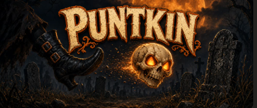
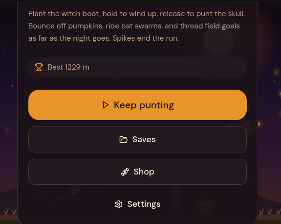
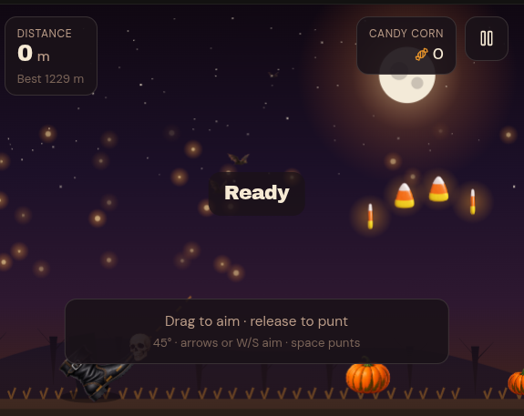
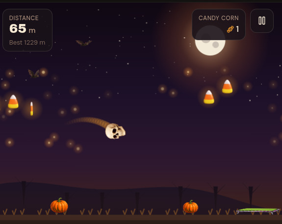

# PUNTKIN

[Play it free](https://rleo0069-del.github.io/puntkin/) — anyone can. No account. No paywall.

## Halloween 2026 HEAD GAME CONTEST

Hosted by Rose Leo ([@Rose_M_Leo](https://x.com/Rose_M_Leo)). Highest verified distance wins **$10**.

- Play: https://rleo0069-del.github.io/puntkin/
- Official Rules: https://rleo0069-del.github.io/puntkin/contest.html
- Enter on X by replying to the official @Rose_M_Leo contest post with a full-run recording.
- Ends 11:59:59 p.m. Central Time, November 1, 2026.
- There is no maximum score. Distance is time in the air. Spikes end the run.
- No purchase necessary. Not sponsored by X.

Plant the witch boot. Punt the skull. Chase candy corn through the graveyard night.

Hold to wind up, release to punt. Bounce off pumpkins, ride bat swarms, thread field goals. Spikes end the run.

## This game is free to play

PUNTKIN is free to play. It is **not** public domain.

Copyright © 2026 Rose Leo. All rights reserved. See [LICENSE](LICENSE).

Play the official game. Do not copy, remix, rehost, or sell the code or art without permission.

## Menu

## Kickoff

## In flight

## Files

Open `index.html` locally if you want. Keep the `assets` and `sprites` folders next to it.
